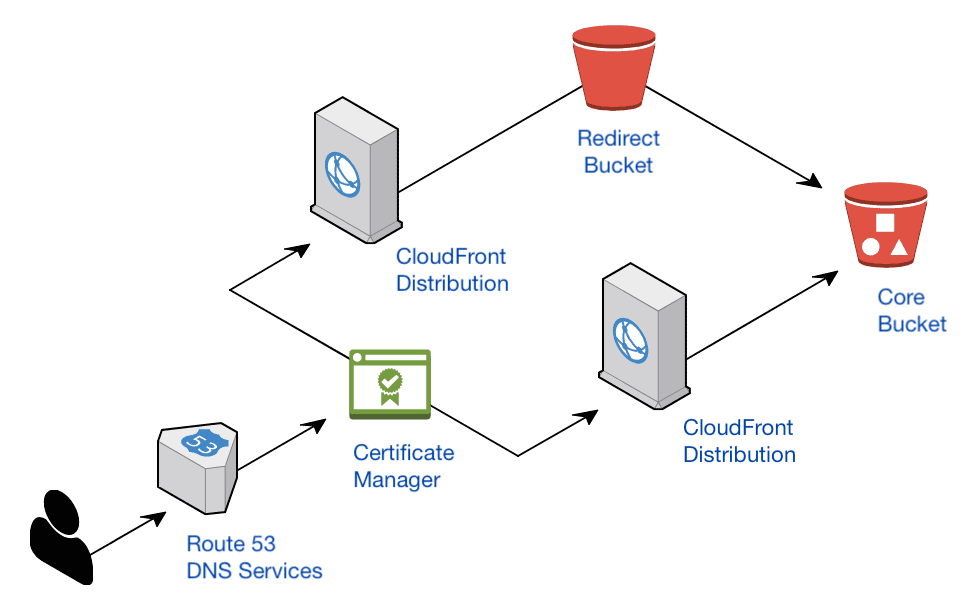

# AWS-Serverless-Guides

**Infrastructure guides for hosting secure, static sites on Amazon Web Services**

These guides allow developers unfamiliar with the AWS platform to deploy a secure site using static site generators like [GatsbyJS](https://www.gatsbyjs.org/). The site contents are served with auto-renewing HTTPS certificates, delivered on a CDN for faster response times, and will redirect to the canonical domain for better search engine ranking.

To learn the main configuration of each AWS service, you will be given specific instructions on where to customize options in the web-based Management Console. In the later guides, you will be shown how to accomplish many of the tasks through CLI-based terminal commands.

**Customizing Services in the Management Console**
  * [Setting up S3 for Domain Redirects](./guides/Setting-Up-S3-for-Domain-Redirects.md)
  * [Creating CloudFront Distributions](./guides/Creating-CloudFront-Distributions.md)
  * [Invalidating Old Data on CloudFront](./guides/Invalidating-Old-Data-on-Cloudfront.md)
  * [Managed Certificates and DNS Services](./guides/About-Certificate-Manager-and-Route-53.md)
  * [Creating a SSL/TLS Certificate for a Custom Domain](./guides/Creating-a-SSL-TLS-Certificate-for-a-Custom-Domain.md)

**Customizing Services through the CLI**
  * [Setting up IAM Identities](./guides/Setting-Up-IAM-Identities-for-CLI.md)
  * [Installing the CLI Tools](./guides/Setting-Up-AWS-CLI-Tools.md)
  * [CLI Cheat Sheet of Common Tasks](./guides/AWS-CLI-Cheatsheet.md)

**Additional Guides**
  * [Canonical Tags and URL Rewrites](./guides/Canonical-Tags-and-URL-Rewrites.md)

