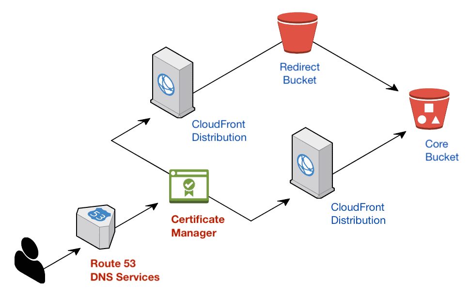

## AWS Certificate Manager

#### Managed certificate renewal
ACM creates free HTTPS certificates that are continuously renewed by Amazon. These managed renewals are more reliable than the common alternative certificates from "Let's Encrypt" which require cron jobs for certificate renewal. These cron jobs can unexpectedly fail when rare events aren't fully covered in the timing configuration.

#### More secure site traffic, better SEO
TLS is "[Transport Layer Security](https://en.wikipedia.org/wiki/Transport_Layer_Security)" and the older SSL protocol is "Secure Sockets Layer". A TLS-enabled site will encrypt all network traffic in a HTTPS connection, preventing attackers from inspecting the traffic or modifying it while in transit. All browsers will show a prominent "Not Secure" label next to the website if no TLS certificate is installed. TLS-enabled sites also score higher in Google's search rankings.

## Route 53 DNS management
In these guides, we will assume a more complex situation where you have multiple business clients that have bought their own domains at different registries.

#### Mixed ownership: client controls domain, we control the DNS records
A client may have primary control of a domain name. To manage that domain on AWS, we need the domain's nameserver records pointing to Route 53. This configuration gives us the ability to customize all DNS records for that domain, including the CNAME records needed for certificate creation.

#### Requesting nameserver configuration
When a Record Set is made for a new Hosted Zone in Route 53, 4 NS records will be shown. When the client owns the domain through a third-party registrar, you can ask the client's IT team to change the domain's nameservers in the registrar's DNS configuration to point towards the 4 AWS nameservers listed in the Record Set.

When the domain's nameservers are set to Route 53's nameservers, we can then create the certificate and succesfully validate the domain in Route 53.

Continue to the [certificate creation guide](./Creating-a-SSL-TLS-Certificate-for-a-Custom-Domain.md).
