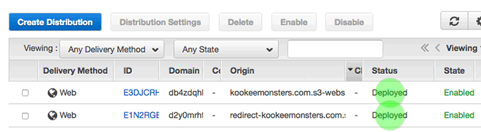

# Sections in this guide
  - [ ] [Introduction to CloudFront](./Creating-CloudFront-Distributions.md#introduction-to-cloudfront)
  - [ ] [Create a distribution for the origin bucket](./Creating-CloudFront-Distributions.md#create-a-distribution-for-the-origin-bucket)
  - [ ] [Customizing error pages](./Creating-CloudFront-Distributions.md#customizing-error-pages)
  - [ ] [Invalidating old content](./Creating-CloudFront-Distributions.md#invalidating-old-content)
  - [ ] [Deleting a distribution](./Creating-CloudFront-Distributions.md#deleting-a-distribution)
  - [ ] [Resources](./Creating-CloudFront-Distributions.md#resources)

---

## Introduction to CloudFront
### Distributions
A "distribution" is the collection of an origin location (your website) and edge locations. The content delivery network (CDN) makes clones of the origin content and places them at edge locations closer to the end user for faster delivery.

### Origin bucket
We will use a S3 bucket as the origin location for our content. S3 buckets can host static website content, which can be cheaper, faster, and easier to maintain than live servers. The distribution in front of this bucket will redirect insecure links to secure ones.

### Standard behaviors
We will set up typical features for faster content delivery and better search engine indexing:
  * Enable GZIP for network transfers
  * Set refresh for new content at 1 hour
  * Redirect the insecure protocol `http://www.example.com` to the secure `https://www.example.com`

---

## Create a distribution for the origin bucket
To keep the instructions from becoming too unwieldy, the scenario below assumes you are only making 1 basic distribution.

To accomodate the [recommended approach](./Setting-Up-S3-for-Domain-Redirects.md#introduction) of having 2 S3 origin buckets, you will need to repeat the instructions below for the redirect bucket. Later, we will further customize the basic distributions you create here to [incorporate custom domains](./Creating-a-SSL-TLS-Certificate-for-a-Custom-Domain.md).

1. Log into the AWS Management Console and search for [CloudFront](https://console.aws.amazon.com/cloudfront/home?#)
1. "Create Distribution" button > Web delivery method > "Get Started" button
1. Origin Domain Name: **DO NOT** choose your S3 bucket from the dropdown list
    * Put in the [Static Website Hosting](./Static-Website-Hosting-Endpoints-vs-API-Path-Endpoints.md) endpoint.
    * The endpoint will have `-website-` in its name, like:
      * `example.com.s3-website-us-west-1.amazonaws.com`
1. Origin ID: will automatically fill in if you pick your S3 bucket
1. Enable HTTPS
    * Viewer Protocol Policy: Redirect HTTP to HTTPS
1. Set Minimum TTL to be 1 hour before CloudFront fetches from the origin
    * Object Caching: Customize
    * Minimum TTL: 3600
1. Enable GZIP
    * Compress Objects Automatically: Yes
1. Price Class: "Use Only U.S., Canada and Europe"
    * If your services aren't available outside the U.S., then you should pick this lower price class
1. Default Root Object: `index.html`
    * If React Router can't handle loading `domain.com/index.html` without showing an error, then leave this value blank
1. Click "Create Distribution" button

It may take up to 15 minutes for CloudFront to clone your content to all geographic regions. The status will be "Deployed" when it's done.

## Customizing error pages
One strategy for a simpler website is to redirect 404 and 500 errors to the main index page. This may not be desirable if you use analytics data to find broken links.

In this simpler strategy, we will respond to respond to broken links with a redirect to `index.html` and a 200 status code. We are trying to avoid being blocked by corporate firewalls and proxies, which may block 4xx and 5xx responses. We only need to customize the error pages for the distribution in front of the core bucket, not the redirect bucket.

1. Click on the ID of the newly created distribution (origin should match your bucket's Static Website Hosting endpoint)
2. "Error Pages" tab > "Create Custom Error Response" button
   * HTTP Error Code: 403: Forbidden
   * Customize Error Response: Yes
     * Response Page Path: `/index.html`
     * HTTP Response Code: "200 OK" (Not 403)
     * Press the 'Create' button
3. Repeat step 2 above for Error Code: "404: Not Found"
   * HTTP Response Code: "200 OK" (Not 404)

Again, it may take up to 15 minutes for your changes to spread across the CloudFront distribution.

## Invalidating old content
[View the guide](./Invalidating-Old-Data-on-Cloudfront.md) about deleting all copies of the content and forcing the distribution to pull from the source bucket again.

## Deleting a distribution
1. Enable the checkbox for your distribution > "Disable" button > "Yes, Disable" > "Close" button (can take up to 15 minutes)
2. After the status is "Deployed" instead of "In Progress", enable the checkbox for your distribution > "Delete" button > "Yes, Delete" > "Close" button

# Resources
  * http://lofi.fi/deploying-gatsbyjs-to-amazon-aws/
  * https://aws.amazon.com/blogs/aws/new-gzip-compression-support-for-amazon-cloudfront/
  * https://aws.amazon.com/premiumsupport/knowledge-center/cloudfront-serve-static-website/
  * https://docs.aws.amazon.com/AmazonCloudFront/latest/DeveloperGuide/HowToDeleteDistribution.html

