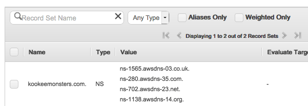
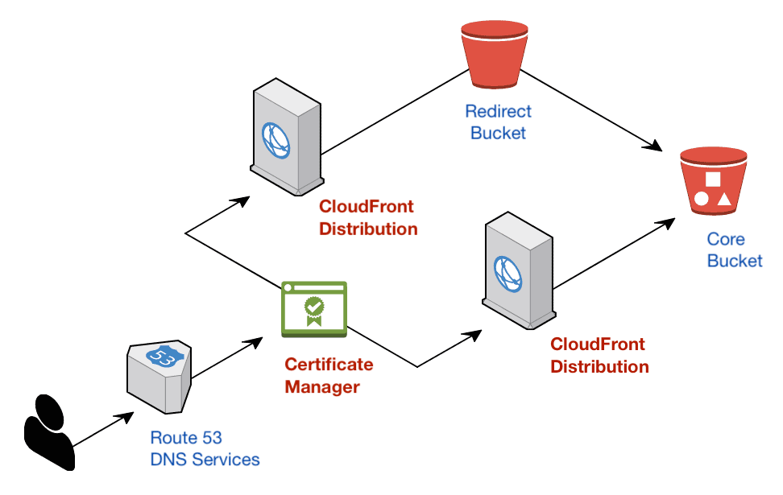

# Sections in this guide
  - [ ] [**Create a hosted zone**](./Creating-a-SSL-TLS-Certificate-for-a-Custom-Domain.md#create-a-hosted-zone)
  - [ ] [**Create a certificate tied to a custom domain**](./Creating-a-SSL-TLS-Certificate-for-a-Custom-Domain.md#create-a-certificate-tied-to-a-custom-domain)
  - [ ] [**Use the certificate in CloudFront**](./Creating-a-SSL-TLS-Certificate-for-a-Custom-Domain.md#use-the-certificate-in-cloudfront)
    * [Use the certificate for the full domain](./Creating-a-SSL-TLS-Certificate-for-a-Custom-Domain.md#use-the-certificate-for-the-full-domain)
    * [Use the certificate for the apex domain](./Creating-a-SSL-TLS-Certificate-for-a-Custom-Domain.md#use-the-certificate-for-the-apex-domain)
    * [Update redirect bucket to use HTTPS](./Creating-a-SSL-TLS-Certificate-for-a-Custom-Domain.md#update-redirect-bucket-to-use-https)
  - [ ] [**Set DNS records with aliases to CloudFront**](./Creating-a-SSL-TLS-Certificate-for-a-Custom-Domain.md#set-dns-records-with-aliases-to-cloudfront)
  - [ ] [**Verify that domain redirection is working**](./Creating-a-SSL-TLS-Certificate-for-a-Custom-Domain.md#verify-that-domain-redirection-is-working)
  - [ ] [**Resources**](./Creating-a-SSL-TLS-Certificate-for-a-Custom-Domain.md#resources)

---

## Create a hosted zone
In all the steps in this guide, replace `example.com` with your custom domain name.

1. In the AWS Management Console, search for [Route 53](https://console.aws.amazon.com/route53/home?)
1. "DNS Management" > "Get started now" button > "Create Hosted Zone" button
    * Domain Name: `example.com`
    * Type: Public Hosted Zone
    * "Create" button
1. You will see 1 NS and 1 SOA record created. With the 4 values in the NS record, ask your client's IT team to change the domain's nameserver records to the 4 listed in Route 53.

## Create a certificate tied to a custom domain
1. In the AWS Management Console, search for [Certificate Manager](https://console.aws.amazon.com/acm/home?region=us-east-1#/)
    * Make sure region is set to "N. Virginia" at top right
    * Only certificates made in "US East - N. Virginia" can be used in CloudFront
1. "Provision Certificates" > "Get started" button > "Request a public certificate" button
    * Domain name: `www.example.com`
1. "Add another name to this certificate" button >
    * Domain name: `example.com`
1. "Add another name to this certificate" button >
    * Domain name: `*.example.com`
    * Press "Next" button
1. Choose DNS validation > "Review" button
1. "Confirm and request" button > "Continue" button
    * Status for both domains will be "Pending validation"
    * If all DNS settings are managed by Route 53, you can click "Create record in Route 53" button underneath the triangle toggle for each domain
      * You should see a "Success" message for each domain

It may take up to 30 minutes for the changes to propagate and for AWS to validate the domains. Certificate requests time out after 72 hours if they can't be validated. The final status for the certificate should be "Issued".

## Use the certificate in CloudFront

Certificates with custom domains can only be used with CloudFront distributions, not with S3 buckets.

The configuration below will follow the [recommended approach](./Setting-Up-S3-for-Domain-Redirects.md#introduction) of first having a core bucket for the full domain "`www.example.com`". Then a redirect bucket will handle forwarding requests for the apex domain "`example.com`" to the full domain.

Two CloudFront distributions sit in front of both buckets for CDN functionality and will be used as the targets for the DNS records.

### Use the certificate for the full domain
1. In the AWS Management Console, search for [ CloudFront ](https://console.aws.amazon.com/cloudfront/home?#)
1. Click on the distribution ID that matches your **core** bucket > "Edit" button > SSL Certificate > Custom SSL Certification
    * In the auto-populated dropdown list, pick the certificate made through Certificate Manager
1. Alternate Domain Names (CNAMEs) > add domain names below and separate them by new lines
    * `www.example.com`
1. "Yes, Edit" button
1. Change the default cache behavior
    * "Behaviors" tab > Select checkbox for "Default (*)" > "Edit" button > Viewer Protocol Policy
    * Change to "**Redirect HTTP to HTTPS**"
    * "Yes, Edit" button

### Use the certificate for the apex domain
1. Go back to the main [CloudFront](https://console.aws.amazon.com/cloudfront/home?#) page
1. Click on the distribution ID that matches your **redirect** bucket > "Edit" button > SSL Certificate > Custom SSL Certification
    * In the auto-populated dropdown list, pick the certificate made through Certificate Manager
1. Alternate Domain Names (CNAMEs) > add domain names below and separate them by new lines
    * `example.com`
1. "Yes, Edit" button
1. Check the default cache behavior
    * "Behaviors" tab > Select checkbox for "Default (*)" > "Edit" button > Viewer Protocol Policy
    * Leave as **HTTP and HTTPS** so we avoid an extra redirect
    * If there are changes, then press "Yes, Edit" button

It will take some time for your changes to propagate across all geographic regions, around 15 minutes.

### Update redirect bucket to use HTTPS
Previously, the bucket would forward requests insecurely. We will now only use the secure protocol to prevent an extra redirect.
1. Log into the management console, [search for S3](https://console.aws.amazon.com/s3/home)
1. Redirect bucket name > "Properties" tab > Static Website Hosting
    * Protocol: `https`
    * "Save" button

## Set DNS records with aliases to CloudFront

Before making the changes below, make sure the CloudFront distributions has a status of "Deployed".

### Create full domain records
1. Log into the AWS Management Console, search for [Route 53](https://console.aws.amazon.com/route53/home?#)
1. "Hosted zones" on left sidebar > [example.com.]() > "Create Record Set" button > change settings on right sidebar
    * Name: `www`**.example.com.**
    * Type: A - IPv4 address
    * Alias: Yes
    * Alias Target: Dropdown list should show your CloudFront distribution for the full domain, so pick it
    * "Create" button
1. "Create Record Set" button > change settings on right sidebar
    * Name: `www`**.example.com.**
    * Type: AAAA - IPv6 address
    * Alias: Yes
    * Alias Target: Dropdown list should show your CloudFront distribution for the full domain, so pick it
    * "Create" button

### Create apex domain records
1. "Create Record Set" button > change settings on right sidebar
    * Name: **example.com.** (leave subdomain as blank)
    * Type: A - IPv4 address
    * Alias: Yes
    * Alias Target: Dropdown list should show your CloudFront distribution for the apex domain, so pick it
    * "Create" button
1. "Create Record Set" button > change settings on right sidebar
    * Name: example.com. (leave subdomain as blank)
    * Type: AAAA - IPv6 address
    * Alias: Yes
    * Alias Target: Dropdown list should show your CloudFront distribution for the full domain, so pick it
    * "Create" button

## Verify that domain redirection is working
In a browser, make sure these domain requests are being redirected:
  * http://www.example.com redirects to https://www.example.com
  * http://example.com redirects to https://www.example.com
  * https://example.com redirects to https://www.example.com

It may take some time for the DNS changes to be seen by your ISP and local company network.

# Resources
  * https://docs.aws.amazon.com/acm/latest/userguide/managed-renewal.html
  * https://docs.aws.amazon.com/acm/latest/userguide/gs-acm-validate-dns.html
  * https://docs.aws.amazon.com/acm/latest/userguide/acm-regions.html
  * https://stackoverflow.com/questions/37520110/aws-acm-wildcard-ssl-certificate-not-working-on-domain/37520314#37520314
  * https://medium.com/@brodartec/hosting-a-static-site-with-https-enabled-using-aws-s3-cloudfront-and-godaddy-826dae41fdc6

