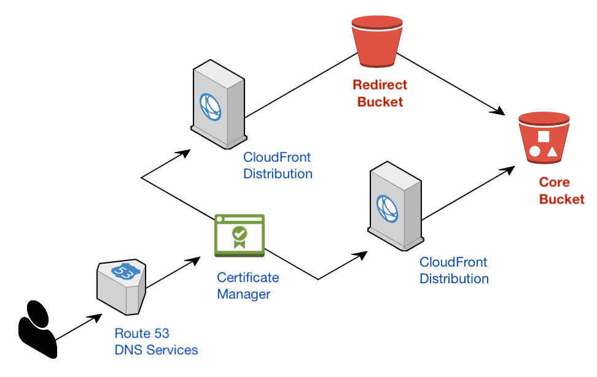
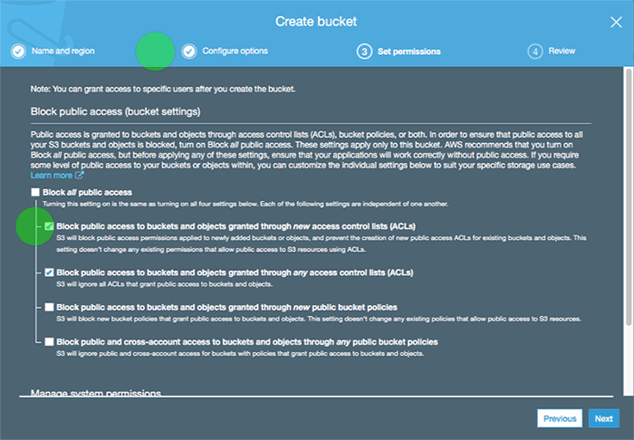
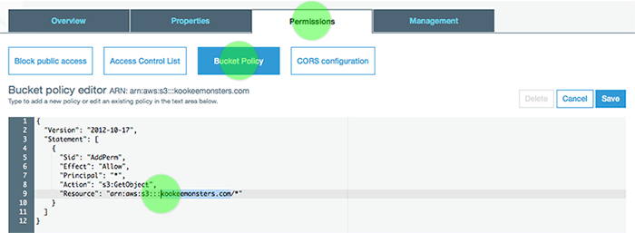
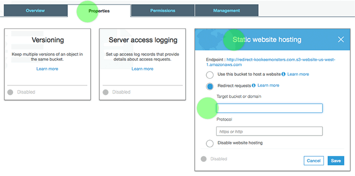

# Sections in this guide
  - [ ] [**Introduction**](./Setting-Up-S3-for-Domain-Redirects.md#introduction)
    - [Use a fully qualified domain for the canonical site](./Setting-Up-S3-for-Domain-Redirects.md#use-a-fully-qualified-domain-for-the-canonical-site)
    - [Avoid duplicate content](./Setting-Up-S3-for-Domain-Redirects.md#avoid-duplicate-content)
  - [ ] [**Set up the core bucket**](./Setting-Up-S3-for-Domain-Redirects.md#set-up-the-core-bucket)
    - [Create a new bucket](./Setting-Up-S3-for-Domain-Redirects.md#create-a-new-bucket)
    - [Allow public read permissions](./Setting-Up-S3-for-Domain-Redirects.md#allow-public-read-permissions)
    - [Enable static website hosting](./Setting-Up-S3-for-Domain-Redirects.md#enable-static-website-hosting)
  - [ ] [**Set up the redirect bucket**](./Setting-Up-S3-for-Domain-Redirects.md#set-up-the-redirect-bucket)
  - [ ] [**Canonical tags and path redirects**](./Setting-Up-S3-for-Domain-Redirects.md#canonical-tags-and-path-redirects)
  - [ ] [**Create, delete, and deploy to buckets in the CLI**](./Setting-Up-S3-for-Domain-Redirects.md#create-delete-and-deploy-to-buckets-in-the-cli)
  - [ ] [**Resources**](./Setting-Up-S3-for-Domain-Redirects.md#resources)

---

# Introduction



We will use 2 buckets to cover the needs for HTTPS security, automatic redirection to the canonical site, and higher search engine ranking. The recommended setup is:
  * **Core bucket** to store site content for the full domain
  * **Redirect bucket** will foward apex domain requests to the core bucket

## Use a fully qualified domain for the canonical site
  * Apex domain: `example.com`
  * Fully qualified domain: `www.example.com`

It's tempting to set up [DNS](http://www.steves-internet-guide.com/dns-guide-beginners/) to use the apex domain of `example.com`. This seems to create a simpler canonical base for all of your hyperlinks. An apex domain is created with a CNAME record. However, new DNS records can't be made from CNAME records.

For example, if you want to host email services on the apex domain, you won't be able to create the necessary MX records from a CNAME record.

It's better to start off all your hyperlinks with `www.example.com` (or any other subdomain like `app.example.com`). By using the `www` subdomain, you have more flexibility in creating additional DNS records for common situations like:
  * MX and SPF records for email services
  * TXT records for domain validation
  * Load balancing options to redirect traffic from subdomains. The "CNAME and A Name" combination records are tied to a raw IP address that can't be load balanced.

## Avoid duplicate content
We will use the full domain `www.example.com` for the core bucket and create a second bucket to redirect the apex domain to the full domain. This configuration avoids content duplication, which lowers ranking scores on search engines.

---

# Set up the core bucket
The core bucket will host your static website content. Replace `example.com` below with the domain of your website.

## Create a new bucket
1. Log into the management console, [search for S3](https://console.aws.amazon.com/s3/home)
1. "Create Bucket" button
    * Bucket name: `example.com`
    * Region: `US West (N. California)` or other region closest to your upload source
    * Click "Next" button 2 times (skip "Configure options")
1. "Configure options" screen

    * Disable "Block all public access"
        * Enable "Block public access through _new_ ACLs"
        * Enable "Block public access through _any_ ACLs"
        * Leave as disabled "Block _new_ public bucket policies"
        * Leave as disabled  "Block _any_ public bucket policies"
    * Press "Next" button
1. "Review" screen > "Create bucket" button

## Allow public read permissions
1. Go back to the [main bucket list](https://console.aws.amazon.com/s3/home), choose `example.com`
1. "Permissions" tab > "Bucket Policy" tab
    
1. Add the public read policy below by pasting it into the policy editor:
    * Replace the phrase `YOURBUCKETNAME` with `example.com`
    ```json
    {
      "Version": "2012-10-17",
      "Statement": [
        {
          "Sid": "AddPerm",
          "Effect": "Allow",
          "Principal": "*",
          "Action": "s3:GetObject",
          "Resource": "arn:aws:s3:::YOURBUCKETNAME/*"
        }
      ]
    }
    ```
1. Press "Save" button

## Enable static website hosting
1. Go back to the [main bucket list](https://console.aws.amazon.com/s3/home), choose `example.com`
1. "Properties" tab > "Static Website Hosting" > Enable option for "Use this bucket to host a website"
    * Index document: `index.html`
    * Error document: `error.html`
        * If React Router is handling 404s, you can use `index.html`
1. Press "Save" button

---

# Set up the redirect bucket
This separate bucket will redirect the apex domain to the core bucket that contains the site content.

1. Log into the management console, [search for S3](https://console.aws.amazon.com/s3/home)
1. Press "Create bucket" button
    * Bucket name: `redirect-example.com`
    * Region: `US West (N. California)` or same as source bucket
1. Press "Next" button 2 times (skip "Configure options")
1. "Set permissions" > leave all defaults intact > "Next" button > "Create bucket" button
1. Go back to the [main bucket list](https://console.aws.amazon.com/s3/home), choose `redirect-example.com`
1. "Properties" tab > Static website hosting:

    * Enable "Redirect requests" option
    * Target bucket or **domain**: `www.example.com`
1. Press "Save" button

---

# Canonical tags and path redirects
Although not required for a basic site, canonical tags can be added later to help boost search engine rankings. If you need Apache-style rewrite rules, S3 has a unique XML-based format. Both of these topics are covered in a [separate guide](./Canonical-Tags-and-URL-Rewrites.md).

---

# Create, delete, and deploy to buckets in the CLI
You can [create public buckets](./AWS-CLI-Cheatsheet.md#create-a-new-public-bucket), [delete buckets](./AWS-CLI-Cheatsheet.md#delete-a-bucket), and [deploy new content](./AWS-CLI-Cheatsheet.md#sync-to-s3) using the terminal utilities.

---

# Resources
  * https://www.netlify.com/blog/2017/02/28/to-www-or-not-www/
  * https://moz.com/learn/seo/canonicalization

